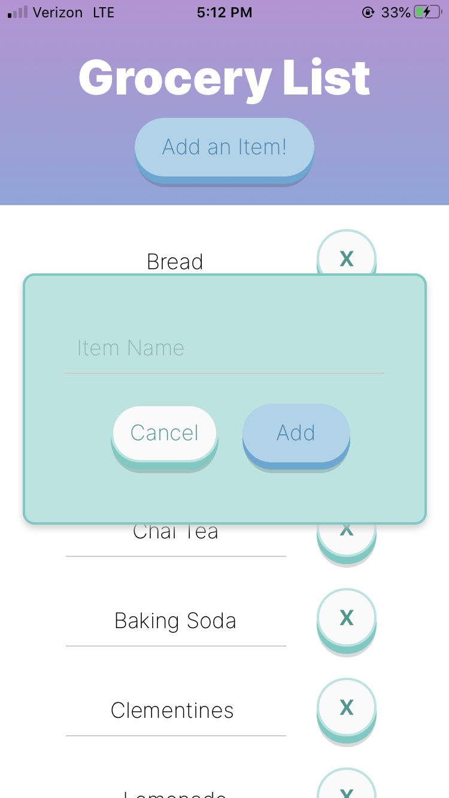
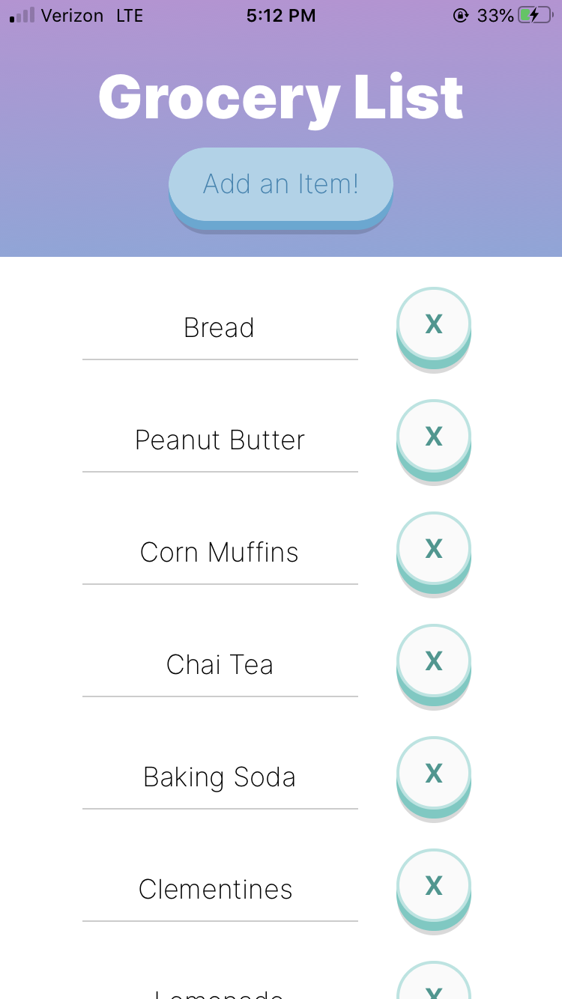

# Grocery List App

My first go at building a mobile app. I designed and built a simple application in React Native where users can add and remove items from a grocery list.

I wanted to get the hang of creating stylesheets in JavaScript rather than CSS, using Flexbox, adding custom fonts, and using other techniques that are distinct from what I had grown accustomed to in ReactJS. I enjoyed using some built-in React Native components such as `<TouchableOpacity>`, `<TouchableHighlight>`, and `<FlatList>`.

Overall, this was a good starter project to get aquainted with React Native and now I am moving on to more complex applications.

## Preview

